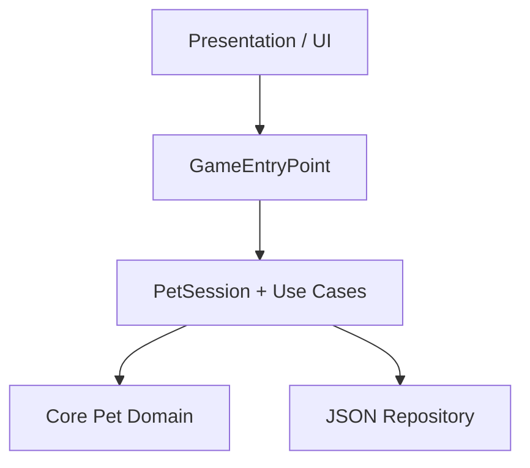

# SuccuPet — Creature Care Technical Assessment

SuccuPet is a real-time virtual pet care prototype built with Unity 6 for Web.
The player selects a starter egg, hatches a pet, maintains four continuously
changing needs, grows the pet through lifecycle stages, and prevents prolonged
neglect from ending the pet's life.

## Submission links

- Playable Web build: `https://indunil.holozee.com/succupet`
- Source repository: `https://github.com/Isuresh98/SuccuPet`
- Candidate: `Indunil Suresh Rathnasooriya`
- Unity version: `6000.0.62f1`

## Core player flow

1. A startup loading screen communicates progress while the game initializes.
2. The player chooses one eligible starter egg from eight displayed options.
3. A confirmation step makes the permanent starter choice clear.
4. The hatching sequence reveals the selected pet.
5. An optional first-care tutorial introduces Feed, Bathe, Play, Sleep, and Wake.
6. The player maintains Fullness, Energy, Happiness, and Hygiene in real time.
7. Successful care grants XP, Affection, and Growth Points.
8. The pet advances from Egg to Bat (Baby), Teen, and Adult.
9. Prolonged neglect lowers hidden Health, causes a recoverable care coma, and
   can eventually cause permanent death.
10. Game Over shows the survived time and allows the player to start a new pet.

## Implemented features

| Area | Implementation |
| --- | --- |
| Needs | Fullness, Energy, Happiness, and Hygiene |
| Real-time simulation | Continuous decay plus elapsed/offline simulation |
| Care actions | Feed, Play, Bathe/Clean, Sleep, and Wake |
| Input protection | Rejected full-stat actions and action cooldown feedback |
| Pet feedback | State text, stat bars, character visuals, animation hooks, and audio |
| Starter flow | Eight eggs, locked/eligible states, confirmation, and hatching |
| Growth | Egg → Bat → Teen → Adult with Default/Special variants |
| Health | Hidden Health evaluation, coma, recovery, death, and restart |
| Progression | XP, level, Affection, Growth Points, and Teen training |
| Persistence | Versioned JSON save data through `Application.persistentDataPath` |
| UX polish | Startup loading screen, background music, and event-driven SFX |
| Testing support | Editor-only SuccuPet QA Console with presets and checklist |
| Target | Unity Web build with mobile-responsive UI |

## Controls

- **Feed** — restores Fullness.
- **Play** — restores Happiness.
- **Clean/Bathe** — restores Hygiene.
- **Sleep/Wake** — changes sleeping state and supports Energy recovery.
- **Evolve** — advances a pet when its current growth gate is complete.
- **Test Training** — prototype hook used to demonstrate Teen training logic.
- **Start New Pet** — clears a dead run and returns to starter egg selection.

Actions can be rejected when the relevant need is already nearly full, the pet
is sleeping, the egg has not hatched, or the pet is otherwise unable to act.

## Run the project

1. Clone or download the repository.
2. Open it with Unity `6000.0.62f1` or the exact version in
   `ProjectSettings/ProjectVersion.txt`.
3. Open `Assets/_Project/Scenes/Bootstrap.unity`.
4. Wait for script compilation to finish and confirm that the Console has no
   red errors.
5. Press Play.

## Architecture

The project separates domain rules, use cases, persistence, scene composition,
and presentation.

- `Core` contains needs, health, care, starter egg, and growth rules.
- `Application` contains use cases and the active `PetSession`.
- `Infrastructure` contains JSON persistence and save migration.
- `Bootstrap` composes dependencies and controls startup/autosave.
- `Presentation` binds domain state to Unity UI, animation, loading, and audio.
- `Editor` contains QA tooling and is excluded from player builds.

## Persistence

The active state is saved as `pet-state-v1.json`. The save schema is versioned
and currently includes identity, timestamps, sleep/coma/death state, lineage,
colour data, lifecycle growth, four needs, XP, Affection, and Coins.

Web saves are browser/device specific. Clearing browser site data or using a
different browser starts a fresh local save.

## QA Console

Open `Tools > SuccuPet > QA Console` inside the Unity Editor. It supports:

- Manual save-data editing
- New player, healthy, low-needs, sleeping, coma, dead, and evolution presets
- Offline-time simulation
- Live care actions
- Save/restart helpers
- A final submission checklist

The QA Console is located under an `Editor` folder and is not included in the
Web build.

## Build settings

Recommended release settings:

- Platform: Web
- Development Build: Off
- Code Optimization: Runtime Speed
- Compression Format: Gzip
- Decompression Fallback: On
- Strip Engine Code: On
- Exceptions: Explicitly Thrown Exceptions Only

## Known limitations

- Closing the app during the optional first-care tutorial may restart that
  tutorial from its first step. The tutorial can be skipped and this does not
  affect the core care, save, growth, or death flows.
- Cafe-exclusive eggs are presented as locked prototype content; the external
  cafe/account unlock service is outside this assessment scope.
- Teen training uses a development demonstration button instead of a complete
  School/Gym activity screen.
- Saves are local only; cloud sync, authentication, backend APIs, and admin
  tools are intentionally outside the assessment scope.

## Documentation

- [`Docs/DESIGN_AND_TECHNICAL_NOTES.md`](Docs/DESIGN_AND_TECHNICAL_NOTES.md)
- [`Docs/FINAL_QA_CHECKLIST.md`](Docs/FINAL_QA_CHECKLIST.md)
- [`THIRD_PARTY_NOTICES.md`](THIRD_PARTY_NOTICES.md)

## Asset and AI disclosure

Third-party asset sources and licences are recorded in
`THIRD_PARTY_NOTICES.md`. AI-assisted tools were used for planning, code review,
and boilerplate acceleration. 

